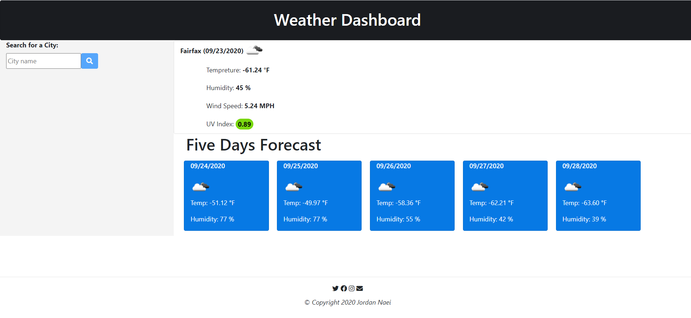

# 06 Server-Side APIs: Weather Dashboard
```
This project aim to provide the client with the ability to get the current weather and five days forecast for any City of his choosing. We added some enhacement to the app to render displaying current weather for the current location on initializing the Websitem, in case no research history is found.

to ensure the following:
    -	ensuring that people with disabilities can acccess the website.
    -	Prevent any possible litigations.
Our Dev team built the Website and optimized the html and css code to meet the client expectations. The list below identifies the changes and enhancement our Dev team applied to the code:
    1-	The usage of regular divs instead of other semantic html 5 elements, for simplicity.
    2-	Ensure that the html and css style guide criteria is met.
    5-	Generated report to the before and after website code base to exhibit the benefits of our enhancement in the following category:
    . Performance.
    . Best practices.
    . Accessibility.
    . SEO.
    6- Ensuured that the website is responsive enough to variety of view ports sizes.
    7- We included sceenshots of different reports to confirm the deliveriables. (Please check the word document attached).
```

## User Story

```
AS A traveler
I WANT to see the weather outlook for multiple cities
SO THAT I can plan a trip accordingly
```

## Acceptance Criteria

```
GIVEN a weather dashboard with form inputs
WHEN I search for a city
THEN I am presented with current and future conditions for that city and that city is added to the search history (pass)
WHEN I view current weather conditions for that city
THEN I am presented with the city name, the date, an icon representation of weather conditions, the temperature, the humidity, the wind speed, and the UV index (pass)
WHEN I view the UV index
THEN I am presented with a color that indicates whether the conditions are favorable, moderate, or severe (pass)
WHEN I view future weather conditions for that city
THEN I am presented with a 5-day forecast that displays the date, an icon representation of weather conditions, the temperature, and the humidity (pass)
WHEN I click on a city in the search history
THEN I am again presented with current and future conditions for that city (pass)
WHEN I open the weather dashboard
THEN I am presented with the last searched city forecast (pass)
```
###
Deployed application URL: https://jordannaei.github.io/codeQuiz/index.html


###
Mobile Friendly checker:


###
DevTool Test:


